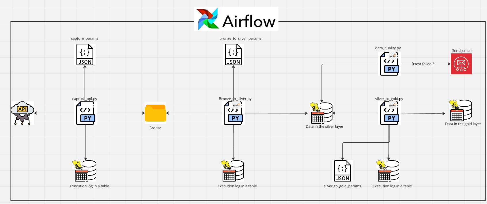

# capture_data_from_api

To execute the script, open Git Bash in the root folder and run:

`./setup.sh`

After completing the above command, to run the pipeline for the pre-registered table, execute:
`./run_brewery_breweries.sh`

# Logs
The Logs component is responsible for recording all the steps of each code execution, marking the start of the job execution, time taken for each step, and the name of the step. 
In case of failure, it sends an email to the email specified with `--email_on_failure` (if applicable), logs the failure in the `desc_error` field, and updates the job status to `failed`.
At the end of each job execution, whether successful or not, the Logs component saves the execution information in the `logs.job_name` table.

# API Capture
The architecture consists of a script that captures data from an API and saves it as a CSV file in the Bronze layer. 
To perform the capture, the script requires the following mandatory parameters:
- `--table_name` (str): Name of the table.
- `--source` (str): Data source.

Optional parameter:
- `--email_on_failure` (email): Email to notify in case of failures. This email must be pre-registered in AWS SES.

Capture-specific parameters, such as the API URL, must be provided in a JSON file located at `params/source/table_name.json`.

# Bronze to Silver
For moving data from the Bronze layer to the Silver layer, the script accepts the same parameters as the capture script:
- Mandatory: `--table_name` (str) and `--source` (str).
- Optional: `--email_on_failure` (email).

Processing-specific parameters must also be stored in a JSON file at `params/source/table_name.json`, requiring additional fields:
- `schema` (dict): A dictionary where keys are column names and values are data types.
- `target_schema` (str): The schema where the table will be saved.
- `target_table` (str): The name of the table to be saved in the Hive Metastore.

The component validates whether the target schema or table exists and creates them if necessary.

# Silver to Gold
This layer involves refining the data, where queries are executed on previously processed tables to generate cleaned and/or joined datasets. 
The script expects the following parameters:
- Mandatory: `--table_name` (str): The destination table in the Gold layer.
- `--source` (str): The data source.
- Optional: `--email_on_failure` (str): Email for failure notifications.

The query to be executed must be located at `query/gold/table_name.sql`. The JSON file for parameters must be stored at `params/source/table_name.json` with the following required fields:
- `target_table` (str): The name of the destination table.
- `target_schema` (str): The name of the destination schema.
- `partition_column` (str): The column used for partitioning, if applicable.
- `mode` (str): Insert mode (`overwrite` or `append`).

# Data Quality

The Data Quality component is responsible for running tests on columns, such as checking for null values, blank values, or values outside the expected range. 
The script requires the following parameters:
- Mandatory: `--table_name` (str).
- Optional: `--email_on_failure` and `--email_on_success` (email).

The dataset used for testing is generated by executing a SQL query located at `query/quality/table_name.sql`. The set of tests must be defined in a JSON file located at `params/quality/table_name.json`, with the following main parameter:
- `quality_params` (dict): A dictionary of dictionaries where each key represents a test name, and the values represent the required parameters for the test.
